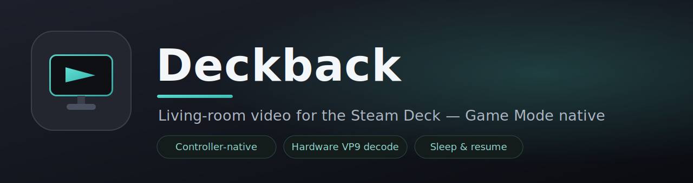
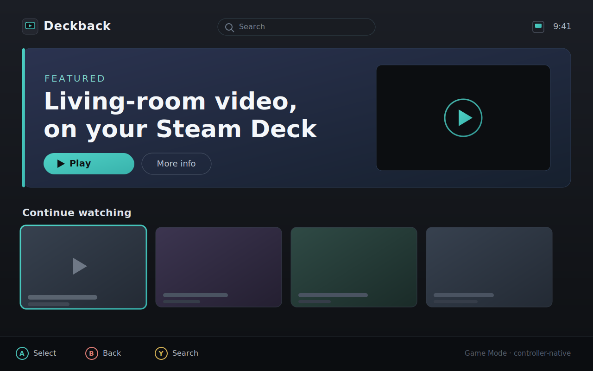
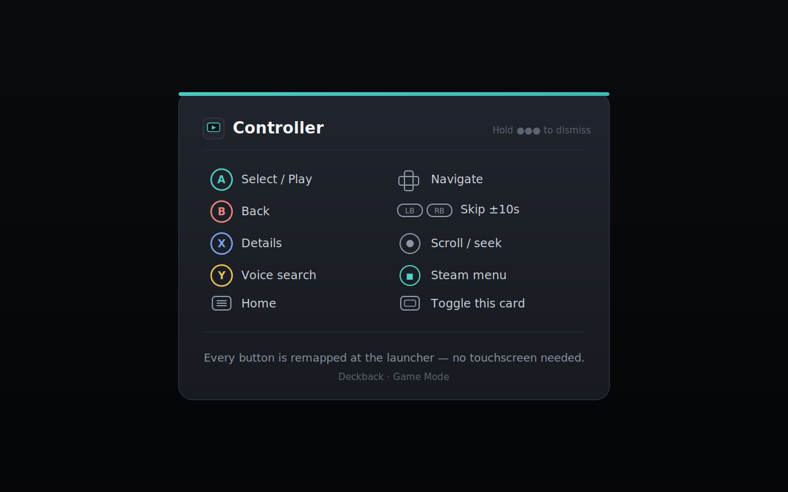
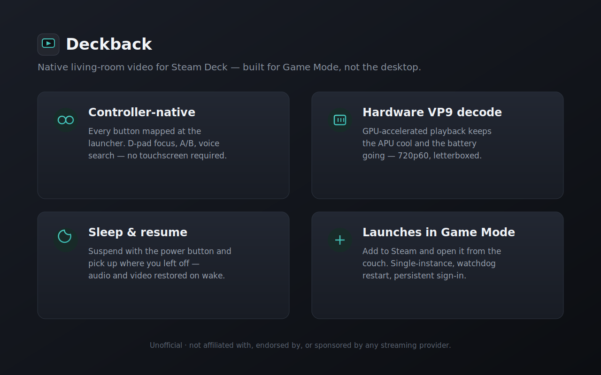

<p align="center">
  
</p>

<p align="center">
  <a href="#-install--play-on-steam-deck"></a>
  
  
  
</p>

# Deckback

An **unofficial** client for YouTube's TV interface (Leanback), built on the open-source
Chromium-based [Cobalt](https://github.com/youtube/cobalt) engine, for the **Steam Deck** in
**Game Mode**. It launches straight from your Steam library like a console app: full controller
navigation, hardware-decoded playback, and clean sleep/resume — aiming for PS5-app parity on a
handheld.

<p align="center">
  
  
  
</p>
<p align="center"><sub>Illustrative UI — Deckback renders the real living-room web app.</sub></p>

> Not affiliated with, endorsed by, or supported by Google or YouTube. Like VacuumTube and Kodi's
> YouTube plugins, Deckback depends on Google continuing to serve its TV interface to this client.

## ✨ Features

- **Console-style controller navigation** — the whole TV UI driven from the gamepad (A select,
  B back, D-pad navigate, LB/RB seek ∓10 s, sticks scroll), mapped at the embedder layer, not
  fragile page scripting.
- **Hardware-decoded video** — VP9 through VA-API on the Deck's APU, measured at **~5.6 W** under
  1080p playback (well under the ≤9 W target); H.264/AAC fallback built in, AV1 steered away from.
- **Clean sleep/resume** — suspends and wakes with the app alive, playback and audio intact — no
  black screen, no relaunch.
- **In-app Settings (OSD)** — a controller-driven overlay (Menu button) for key hints, an About
  panel, and self-update status — drawn by the launcher, so a YouTube UI change can't break it.
- **Self-update, opt-in and painless** — detects a new release from our Flatpak repo and offers to
  install it from inside the app (notify mode; verified end-to-end on both OLED and LCD APUs).
- **Handheld-appropriate touch** — the touchscreen is made inert by default so a stray palm tap
  never yanks you out of what you're watching.
- **Persistent sign-in**, deep-link/launch integration, single-instance locking, and a TV user-agent
  so YouTube serves the real 10-foot interface.
- **Sandboxed & self-hosted** — ships as a Flatpak (zypak sandbox, not `--no-sandbox`); no DRM is
  ever bundled (Widevine is user-supplied, best-effort L3).

## ⚠️ Disclaimer

**Deckback is an independent, unofficial project, provided "as is" with no warranty of any kind.**

- It is **not affiliated with, authorized, endorsed by, or sponsored by Google LLC or YouTube.**
  "YouTube", "Steam Deck", "SteamOS", and other names are trademarks of their respective owners and
  are used here only nominatively, to describe what Deckback interoperates with.
- **Use it at your own risk.** To the maximum extent permitted by law, the authors and contributors
  accept **no responsibility or liability** for any damage, data loss, account action, service
  interruption, or other consequence arising from downloading, installing, or using this software.
  See the "Disclaimer of Warranty" and "Limitation of Liability" sections of the [LICENSE](LICENSE).
- Deckback relies on Google continuing to serve its TV interface to this client and **may stop
  working at any time** without notice.
- Deckback does **not** bundle, redistribute, or circumvent any DRM. The Widevine CDM is never
  shipped by this project; a user may optionally supply their own. See [`docs/legal.md`](docs/legal.md).

- **Targets:** Steam Deck **OLED (Sephiroth)**, SteamOS 3.x, Game Mode only. The **LCD (Van Gogh)** shares the same code path and should work, but we own no LCD unit and have never tested one — treat it as best-effort.
- **App id:** `io.github.properrr.deckback`
- **Status:** pre-alpha, and honest about it. It boots, signs in, browses and plays on a real Deck in
  Game Mode; controller navigation, persistent sign-in, sleep/resume (verified 2026-07-10) and audio
  work. It **ships hardware VP9 decode** (VA-API): blocked on m114 by green-band corruption, it was
  re-tested and came back **clean on M138/cobalt-27** (the current pin) and verified on-Deck
  2026-07-10 — at **5.6 W** average under HW-decode playback (`just power`, OLED), under the ≤~9 W
  target. Suspend/resume (`just soak`) also passed on 2026-07-10. The touchscreen is
  made **inert by default** (`disable_touch`, verified 2026-07-10); the earlier touch-*lock* is proven
  dead and disabled. Voice search, Widevine, and text entry are unverified or unbuilt. Every result so
  far is from an **OLED** unit — the LCD has run nothing.
- **How it works:** [`docs/HOW-IT-WORKS.md`](docs/HOW-IT-WORKS.md) walks through every subsystem and
  its honest status. The full design lives in
  [`.internal/steamdeck-cobalt-youtube-plan.md`](.internal/steamdeck-cobalt-youtube-plan.md); the
  execution checklist is [`.internal/TASKS.md`](.internal/TASKS.md); what is actually tested versus
  merely implemented is in [`.internal/TEST-PLAN.md`](.internal/TEST-PLAN.md). All agent/planning
  docs live under [`.internal/`](.internal/); `docs/` holds public deliverables (how-it-works,
  support, legal).

## 🎮 Install & play (on Steam Deck)

> **Pre-alpha.** You install this yourself, at your own risk (see the disclaimer above). Deckback
> never bundles or downloads any DRM module; free content needs nothing extra.

### 1 · Install — one command (recommended)

Switch to **Desktop Mode**, open **Konsole**, and paste:

```sh
curl -fsSL https://properrr.github.io/deckback/install.sh | bash
```

That installs Deckback from our repo (so it **auto-updates**), grants the gamepad the access it
needs, and adds the **Steam tile with full library artwork** — no manual steps. It will ask you to
**fully close Steam** for the library edit (it waits, and backs up your shortcuts first). When it
finishes, return to Game Mode and Deckback is in your library. *(Verified end-to-end on-device.)*

- Needs **flatpak ≥ 1.16** (SteamOS 3.5+ ships it); the installer checks and stops early otherwise.
- First run pulls the `org.freedesktop.Platform` 25.08 runtime from Flathub (a few minutes).

<details>
<summary><b>Prefer to do it by hand?</b> (or install a single-file bundle)</summary>

**From our repo (auto-updates):**

```sh
flatpak remote-add --user --if-not-exists deckback \
  https://properrr.github.io/deckback/deckback.flatpakrepo
flatpak install --user deckback io.github.properrr.deckback
```

**Or a single `.flatpak` file** (no auto-update) from the
[**Releases**](https://github.com/properrr/deckback/releases) page:

```sh
flatpak install --user -y io.github.properrr.deckback.flatpak
```

Sanity check: `flatpak info --show-permissions io.github.properrr.deckback | grep devices` should
list `input` (the gamepad) and `dri` (the GPU).

**Then add it to Steam** (still in Desktop Mode — there is no "Add a Non-Steam Game" in Game Mode):

```sh
steamos-add-to-steam \
  "$(flatpak info --show-location io.github.properrr.deckback)/export/share/applications/io.github.properrr.deckback.desktop"
```

To also skin the tile with the shipped capsule/hero/logo/header/icon art, copy
[`flatpak/assets/steam/`](flatpak/assets/steam/) + `scripts/steam_shortcuts.py` to the Deck and,
**with Steam closed**, run `python3 steam_shortcuts.py art --appname Deckback --assets <that folder>`.

</details>

### 2 · Controller layout (Game Mode)

Back in **Game Mode**, open the **Deckback** shortcut → the gamepad (controller) settings → and apply
the community **Deckback** layout (mirrors [`config/steam_input.vdf`](config/steam_input.vdf)) so the
standard buttons reach the in-app input layer:

| Button | Action | Button | Action |
|---|---|---|---|
| **A** | Select / play | **D-pad** | Navigate |
| **B** | Back | **LB / RB** | Seek ∓10 s |
| **X** | Details | **Y** | Voice / search |
| **View** | Toggle controls card | **Menu** | Home |

> ℹ️ The one-line installer already sets the library artwork. Steam only exposes a **name and icon**
> for non-Steam shortcuts — there is no *description* field — so that part of a store listing simply
> doesn't exist for a sideloaded app.

## Updating

How you get updates depends on how you installed Deckback:

| You installed from… | How updates reach you |
|---|---|
| A **`.flatpak` bundle** (a single Releases file) | **Manual.** A bundle has no remote to poll — download the newer `.flatpak` and `flatpak install` it again to upgrade. |
| Our **Flatpak repo** at [properrr.github.io/deckback](https://properrr.github.io/deckback/) (added once, above) | **Automatic** — `flatpak update`, and Discover's background updates on the Deck. |
| **Flathub** *(planned — see below)* | **Automatic.** Every Deck already trusts the `flathub` remote, so updates just arrive. |

## 📦 Official store

<p>
  
</p>

Deckback is **not on Flathub yet**. When it is published, this section will carry a one-command
install and the store link, and updates will arrive automatically. Until then, use the bundle from
[Releases](https://github.com/properrr/deckback/releases) as described above.

<!-- FLATHUB-STUB: replace when published
[](https://flathub.org/apps/io.github.properrr.deckback)

    flatpak install flathub io.github.properrr.deckback
-->

## Repository layout

| Path | What |
|---|---|
| `cobalt/` | gclient-managed Chromium/Cobalt checkout (gitignored), pinned by `DEPS.pin` |
| `patches/` | rebaseable quilt series applied over the pinned commit (C++17, in-tree toolchain) |
| `launcher/` | standalone C++23 shim: config, sleep-watcher, idle-inhibit, watchdog, CDM fetcher |
| `config/` | `app.json` (UA/URL/caps/keymap, hot-swappable), injected JS (`av1_steering.js`, `no_pointer.js`) + `steam_input.vdf` controller template |
| `args/` | GN arg presets: `dev`, `deck`, `asan` |
| `docker/`, `docker-compose.yml` | Debian 12 build env matching Cobalt trunk (source bind-mounted, never baked in) |
| `scripts/`, `justfile` | command runner — every `just` recipe delegates to a `scripts/*.sh` |
| `flatpak/` | Flatpak manifest (zypak-sandboxed) |
| `docs/` | public deliverables: `HOW-IT-WORKS.md`, `SUPPORT.md`, `legal.md` |
| `.internal/` | agent/planning docs: design doc, `TASKS.md`, `TEST-PLAN.md`, `findings/` (durable + per-milestone), `MIGRATION.md` |

## Quick start

```sh
cp .env.example .env         # set DECK_HOST, CONTAINER_ENGINE, etc.
just --list                  # see all recipes

# The launcher builds standalone with no Chromium checkout:
just launcher test

# Full engine flow (~45 GB disk measured for a --no-history checkout + one preset; 32 GB+ RAM):
just bootstrap               # build container + gclient sync at DEPS.pin
just build dev               # gn gen + autoninja
just smoke                   # headless boot + DevTools assertion
just deploy && just run      # rsync to the Deck and launch over SSH
just remote-run              # launch the installed Flatpak on Game Mode over SSH
```

Put the tree on a real Linux filesystem — a WSL `/mnt/*` mount is case-insensitive and drops mode
bits, and Chromium will not build correctly there.

Builds run on a **workstation/CI, never on the Deck** — the Deck is a deploy/test target over SSH.

## Two toolchains — do not mix

- **In-tree (`patches/`):** C++17, Chromium's hermetic Clang + in-tree libc++. See `patches/README.md`.
- **Out-of-tree (`launcher/`):** C++23, must build clean on Clang ≥18 **and** GCC 14, `-Werror`.

## Contributing

Contributions are welcome — bug reports, fixes, controller layouts, and on-hardware test results all
help. **LCD (Van Gogh) owners especially:** Deckback is developed on an OLED unit, so results from an
LCD are some of the most valuable things you can send.

- **Build & test** — see [Quick start](#quick-start) above. The launcher builds standalone with no
  Chromium checkout, so most launcher and config work needs only `just launcher`.
- **Run `just hooks` once after cloning.** It enables a pre-push hook that runs `just preflight` —
  the exact checks CI runs (shellcheck, the harness suite, clang-format-18, and the launcher
  gcc/clang builds) — so your push won't land red. `just preflight` needs no Chromium checkout and
  runs anywhere; it bootstraps the pinned lint tools itself.
- **Report a bug or request a feature** — open an issue with your SteamOS version, Deck model
  (LCD/OLED), and a log (see *Collecting logs* in [`docs/SUPPORT.md`](docs/SUPPORT.md)).
- **Two house rules** that keep the app honest:
  1. **Never bind a key we haven't verified against the TV interface** — YouTube publishes no key
     contract for it, so a guessed binding silently does nothing.
  2. **Never claim a behavior is verified without a dated on-hardware result.**

Deeper design notes and the Cobalt-bump playbook live under `.internal/`.

## License

[Apache License 2.0](LICENSE). Copyright 2026 The Deckback Authors. See [`NOTICE`](NOTICE) for
attribution and [`docs/legal.md`](docs/legal.md) for trademark, codec, and Widevine notes.

This covers Deckback's own code (the `launcher/`, `config/`, `patches/`, `scripts/`, and docs). The
Chromium/Cobalt engine is fetched at build time and is **not** vendored into this repository; it and
any user-supplied Widevine CDM remain under their own licenses.
